<div align="center">

# 🛰️ HNDSR Production

### Hybrid Neural Operator–Diffusion Super-Resolution for Satellite Imagery

[](LICENSE)
[](https://python.org)
[](https://fastapi.tiangolo.com)
[](https://pytorch.org)
[](docker/Dockerfile)
[](https://huggingface.co/spaces/the-harsh-vardhan/HNDSR-Production)
[](https://github.com/the-harsh-vardhan/HNDSR-Production/actions)

**[Live Demo](https://hndsr.vercel.app)** · **[API Docs](https://the-harsh-vardhan-hndsr-production.hf.space/docs)** · **[Architecture](architecture.md)** · **[Contributing](CONTRIBUTING.md)**

An enterprise-grade, containerized ML inference engine for continuous-scale satellite image super-resolution. Trained end-to-end on Kaggle, deployed on Hugging Face Spaces with a Vercel frontend.

</div>

---

## Table of Contents

- [Live System](#-live-system)
- [Key Features](#-key-features)
- [Architecture](#-architecture)
- [Performance Benchmarks](#-performance-benchmarks)
- [Getting Started](#-getting-started)
- [Deployment](#-deployment)
- [API Reference](#-api-reference)
- [Configuration](#%EF%B8%8F-configuration)
- [Project Structure](#-project-structure)
- [Training & Reproduction](#-training--reproduction)
- [Observability](#-observability)
- [Contributing](#-contributing)
- [Authors](#-authors)
- [License](#-license)

---

## ⚡ Live System

| Component | URL |
| :--- | :--- |
| **Frontend UI** | [hndsr.vercel.app](https://hndsr.vercel.app) |
| **Backend API** | [Hugging Face Space](https://huggingface.co/spaces/the-harsh-vardhan/HNDSR-Production) |
| **Swagger Docs** | [/docs](https://the-harsh-vardhan-hndsr-production.hf.space/docs) |
| **Prometheus Metrics** | [/metrics](https://the-harsh-vardhan-hndsr-production.hf.space/metrics) |

---

## ✨ Key Features

- **3-Stage Neural Pipeline** — Autoencoder → Fourier Neural Operator → Latent Diffusion UNet (~12M parameters)
- **Arbitrary Scale Factors** — Supports non-integer upscaling (2×, 3.14×, 4×, 8×) via learned continuous representations
- **Satellite-Scale Tiling** — `SatelliteTileProcessor` with Hann-window blending for gigapixel images on commodity GPUs
- **FP32/FP16 Hybrid Inference** — FNO spectral ops in FP32 (FFT stability), Diffusion UNet in FP16 (throughput)
- **Production Hardened** — Semaphore concurrency, rate limiting, circuit breaker patterns, graceful shutdown
- **Full Observability** — Prometheus histograms, Grafana dashboards, alerting rules (P99 latency, error rate, GPU OOM)
- **One-Command Deploy** — Docker Compose stack with API, frontend, Prometheus, and Grafana

---

## 🧠 Architecture

HNDSR implements a **3-Stage Sequential Pipeline** that bridges neural operators and generative diffusion:

```mermaid
graph TD
    subgraph "Stage 1: Autoencoder (Structural Foundation)"
        AE_IN["HR Image (3×H×W)"] --> AE_ENC["Encoder (E_θ)"]
        AE_ENC --> AE_LAT["Latent Space (64×H/4×W/4)"]
        AE_LAT --> AE_DEC["Decoder (D_φ)"]
        AE_DEC --> AE_OUT["Reconstructed Image"]
    end

    subgraph "Stage 2: Fourier Neural Operator (Continuous Mapping)"
        NO_IN["LR Image (3×H×W)"] --> NO_LIFT["Lifting Layer (1×1 Conv)"]
        NO_LIFT --> NO_SC["Scale Embedding (MLP)"]
        NO_SC --> NO_FNO["4× FNO Blocks (Spectral Conv)"]
        NO_FNO --> NO_PROJ["Context Prior (c)"]
    end

    subgraph "Stage 3: Latent Diffusion (Perceptual Refinement)"
        D_Z["Noisy Latent (z_t)"] --> D_UNET["Diffusion UNet (ε_θ)"]
        NO_PROJ -.->|Conditioning| D_UNET
        D_T["Timestep (t)"] --> D_UNET
        D_UNET --> D_PRED["Noise Prediction"]
    end

    AE_LAT -.->|Target| NO_PROJ
    D_PRED -->|Iterative Denoising| AE_DEC
```



### How It Works

| Stage | Component | Purpose | Key Detail |
| :---: | :--- | :--- | :--- |
| 1 | **Residual Autoencoder** | Learns a 4× compressed latent manifold | `ResBlocks` + `GroupNorm`, L1 + perceptual loss |
| 2 | **Fourier Neural Operator** | Maps LR → latent via spectral convolutions | Frequency-domain learning, scale-conditioned MLP |
| 3 | **Latent Diffusion UNet** | Iterative denoising for perceptual texture | DDIM sampling (20–100 steps), FNO-conditioned |

> For detailed ASCII architecture diagrams (system topology, inference flow, K8s layout, failure cascades), see [`architecture.md`](architecture.md).

---

## 📊 Performance Benchmarks

Evaluated on the **4× Satellite Super-Resolution Dataset**:

| Method | PSNR ↑ | SSIM ↑ | LPIPS ↓ | Parameters |
| :--- | :---: | :---: | :---: | :---: |
| Bicubic | 24.53 | 0.71 | 0.35 | — |
| EDSR | 26.81 | 0.79 | 0.28 | 43M |
| ESRGAN | 27.14 | 0.81 | 0.24 | 16M |
| **HNDSR (Ours)** | **29.40** | **0.87** | **0.16** | **~12M** |

**+2.26 dB PSNR** over ESRGAN with **25% fewer parameters**.

---

## 🚀 Getting Started

### Prerequisites

- Python 3.11+
- CUDA 12.1+ (for GPU inference) or CPU-only mode
- Docker & Docker Compose (for containerized deployment)

### Installation

```bash
# Clone the repository
git clone https://github.com/the-harsh-vardhan/HNDSR-Production.git
cd HNDSR-Production

# Create a virtual environment
python -m venv .venv
source .venv/bin/activate        # Linux/macOS
# .venv\Scripts\activate         # Windows

# Install dependencies
pip install -r requirements.txt          # Full (dev + test + prod)
# OR
pip install -r requirements-prod.txt     # Production runtime only
```

### Quick Start

```bash
# Start the API server
python -m uvicorn backend.app:app --host 0.0.0.0 --port 8000

# Verify it's running
curl http://localhost:8000/health
```

Open `frontend/index.html` in a browser to use the UI against your local server.

---

## 🐳 Deployment

### Option 1: Docker Compose (Full Stack)

Spins up the API server, frontend (Nginx), Prometheus, and Grafana:

```bash
cd docker
docker compose up -d
```

| Service | Port | Description |
| :--- | :---: | :--- |
| `hndsr-api` | 8000 | FastAPI inference server (GPU) |
| `hndsr-frontend` | 3000 | Static frontend via Nginx |
| `prometheus` | 9090 | Metrics collection |
| `grafana` | 3001 | Monitoring dashboards |

### Option 2: Hugging Face Spaces

The project includes a dedicated [`Dockerfile.hf`](Dockerfile.hf) optimized for HF Spaces:

```bash
# Build locally to test
docker build -f Dockerfile.hf -t hndsr-hf .
docker run -p 7860:7860 hndsr-hf
```

### Option 3: Local Development Server

```bash
pip install -r requirements-prod.txt
DEVICE=cpu python -m uvicorn backend.app:app --host 0.0.0.0 --port 8000 --reload
```

---

## 📡 API Reference

### `GET /health`

Liveness probe. Returns model status, device info, and GPU availability.

```json
{
  "status": "healthy",
  "model_loaded": true,
  "gpu_available": true,
  "gpu_name": "NVIDIA RTX 4050",
  "device": "cuda"
}
```

### `GET /ready`

Readiness probe for load balancers. Returns `200` only when the model is fully loaded.

### `POST /infer`

Run super-resolution inference on a base64-encoded image.

**Request Body:**

```json
{
  "image": "<base64-encoded image>",
  "scale_factor": 4,
  "ddim_steps": 50,
  "return_metadata": true
}
```

**Response:**

```json
{
  "image": "<base64-encoded HR image>",
  "width": 1024,
  "height": 1024,
  "scale_factor": 4,
  "metadata": {
    "latency_ms": 2340,
    "device": "cuda",
    "model": "HNDSR-v1.0.0",
    "fp16": true,
    "tiles_processed": 4
  }
}
```

### `GET /metrics`

Prometheus-compatible metrics endpoint exposing:

- `hndsr_requests_total` — Request counter by method/endpoint/status
- `hndsr_inference_seconds` — Inference latency histogram (P50/P95/P99)
- `hndsr_errors_total` — Error counter by type
- `hndsr_active_requests` — Current in-flight requests gauge

### `GET /version`

Returns API version, model version, and build metadata.

---

## ⚙️ Configuration

All configuration is via **environment variables** (12-factor app):

| Variable | Default | Description |
| :--- | :---: | :--- |
| `DEVICE` | `auto` | Inference device (`auto`, `cuda`, `cpu`) |
| `MODEL_DIR` | `./checkpoints` | Path to model weight files |
| `MAX_CONCURRENT` | `4` | Max simultaneous GPU inferences (semaphore) |
| `MAX_QUEUE_DEPTH` | `20` | Reject requests when queue exceeds this |
| `REQUEST_TIMEOUT_S` | `120` | Per-request timeout in seconds |
| `MAX_PAYLOAD_MB` | `20` | Maximum upload size in MB |
| `MAX_IMAGE_PIXELS` | `16000000` | Maximum input image pixels (16M) |
| `RATE_LIMIT_PER_HOUR` | `100` | Per-IP rate limit |
| `USE_FP16` | `false` | Enable FP16 mixed precision |
| `DDIM_STEPS` | `20` | Default DDIM denoising steps |
| `TILE_SIZE` | `64` | Tile size for large images |
| `TILE_OVERLAP` | `8` | Overlap between tiles (Hann blending) |

---

## 📂 Project Structure

```
HNDSR-Production/
├── .github/
│   ├── ISSUE_TEMPLATE/          # Bug report & feature request templates
│   ├── PULL_REQUEST_TEMPLATE.md
│   └── workflows/
│       ├── code_quality.yml     # Lint (flake8) + pytest + config validation
│       └── docker_build.yml     # Docker image build with BuildKit caching
│
├── backend/
│   ├── app.py                   # FastAPI server — endpoints, middleware, metrics
│   ├── inference_worker.py      # Redis-backed async job worker
│   └── README.md
│
├── frontend/
│   ├── index.html               # Dark-glassmorphism upload UI
│   ├── app.js                   # API client, health polling, drag-and-drop
│   ├── styles.css               # Responsive CSS
│   └── README.md
│
├── training/
│   ├── HNDSR_Kaggle.ipynb       # Complete training notebook (Kaggle)
│   ├── train_pipeline.py        # 3-stage training skeleton
│   ├── experiment_tracking.py   # MLflow integration wrapper
│   └── hpo_config.yaml          # Optuna hyperparameter sweep config
│
├── checkpoints/                 # Model weights (~12M params total)
│   ├── autoencoder_best.pth
│   ├── neural_operator_best.pth
│   └── diffusion_unet_best.pth
│
├── docker/
│   ├── Dockerfile               # Multi-stage CUDA 12.1 production image
│   ├── Dockerfile.dev           # Development image with hot-reload
│   └── docker-compose.yml       # Full stack: API + Frontend + Prometheus + Grafana
│
├── observability/
│   ├── prometheus.yml           # Scrape config (15s interval)
│   ├── prometheus-prod.yml      # Production scrape config
│   ├── alerting_rules.yml       # Critical & warning alert rules
│   └── grafana_dashboard.json   # Pre-built Grafana dashboard
│
├── data_pipeline/
│   ├── etl_pipeline.py          # ETL with SHA-256 integrity hashing
│   └── storage_config.py        # S3/MinIO Pydantic settings
│
├── model_registry/
│   ├── registry_integration.py  # MLflow model registry integration
│   └── canary_deploy.py         # Canary deployment with traffic splitting
│
├── dvc_pipeline/
│   ├── dvc.yaml                 # 5-stage reproducible pipeline
│   └── params.yaml              # Hyperparameters
│
├── tests/
│   ├── conftest.py              # Shared fixtures
│   ├── test_benchmarks.py       # Performance regression tests
│   ├── test_inference_consistency.py
│   ├── test_preprocessing.py
│   └── test_shape_validation.py
│
├── docs/
│   └── PRODUCTION_READINESS_AUDIT.md  # Full production audit report
│
├── Dockerfile.hf               # Hugging Face Spaces deployment image
├── architecture.md             # Detailed ASCII architecture diagrams
├── requirements.txt            # Full dependencies (dev + test + prod)
├── requirements-prod.txt       # Pinned production-only dependencies
├── CONTRIBUTING.md             # Contribution guidelines
├── CODE_OF_CONDUCT.md          # Contributor Covenant
├── SECURITY.md                 # Security policy & vulnerability reporting
└── LICENSE                     # MIT License
```

---

## 🔬 Training & Reproduction

The model was trained end-to-end on **Kaggle** using the notebook [`training/HNDSR_Kaggle.ipynb`](training/HNDSR_Kaggle.ipynb).

### Training Pipeline

```
Stage 1: Autoencoder     →  ~20 epochs  →  L1 + Perceptual Loss    →  Freeze encoder
Stage 2: Neural Operator  →  ~15 epochs  →  MSE Loss (latent space) →  Freeze FNO
Stage 3: Diffusion UNet   →  ~30 epochs  →  Noise Prediction Loss   →  Final weights
```

### Key Training Details

| Parameter | Value |
| :--- | :--- |
| Dataset | 4× Satellite SR (HR/LR pairs) |
| Hardware | Kaggle P100 GPU (16 GB VRAM) |
| Optimizer | AdamW (lr=1e-4, weight_decay=1e-5) |
| Scheduler | CosineAnnealing with warm restarts |
| EMA | Exponential Moving Average (decay=0.999) |
| Batch Size | 8 (Stage 1), 4 (Stage 2–3) |
| Total Parameters | ~12M across all three stages |

### Reproduce Locally

```bash
# Install training dependencies
pip install -r requirements.txt

# Run the DVC pipeline (if data is available)
cd dvc_pipeline
dvc repro
```

Or open the Kaggle notebook directly and run all cells sequentially.

---

## 📈 Observability

The system ships with a full monitoring stack:

### Prometheus Metrics

The `/metrics` endpoint exposes OpenMetrics-compatible data scraped every 15 seconds:

- **Latency**: `hndsr_inference_seconds` histogram with P50/P95/P99 buckets
- **Throughput**: `hndsr_requests_total` counter by endpoint and status
- **Errors**: `hndsr_errors_total` by error type (OOM, timeout, validation)
- **Saturation**: `hndsr_active_requests` gauge

### Alert Rules

Pre-configured in [`observability/alerting_rules.yml`](observability/alerting_rules.yml):

| Alert | Condition | Severity |
| :--- | :--- | :---: |
| HighErrorRate | Error rate > 5% for 2 min | 🔴 Critical |
| InferenceLatencyP99High | P99 > 10s for 5 min | 🔴 Critical |
| GPUMemoryExhausted | GPU mem > 95% | 🔴 Critical |
| ServiceDown | Target unreachable for 1 min | 🔴 Critical |
| LatencyP95Elevated | P95 > 5s for 10 min | 🟡 Warning |

### Grafana Dashboard

A pre-built dashboard JSON is at [`observability/grafana_dashboard.json`](observability/grafana_dashboard.json), visualizing latency distributions, throughput, error rates, and GPU utilization.

---

## 🤝 Contributing

Contributions are welcome! Please read the [Contributing Guide](CONTRIBUTING.md) and [Code of Conduct](CODE_OF_CONDUCT.md) before submitting a PR.

```bash
# Development setup
pip install -r requirements.txt
black .                          # Format code
flake8 .                         # Lint
pytest tests/ -v                 # Run tests
```

---

## 🎓 Authors

| Name | Role |
| :--- | :--- |
| **Adil Khan** | Co-author |
| **Rakshit Modanwal** | Co-author |
| **Harsh Vardhan** | Co-author |
| **Piyush Jain** | Co-author |
| **Yash Vikram** | Co-author |

**Institution:** Indian Institute of Information Technology, Nagpur
**Program:** 5th Semester Mini Project

---

## 📄 License

This project is licensed under the **MIT License** — see the [LICENSE](LICENSE) file for details.

---

<div align="center">

**HNDSR v1.0.0-Stable** · Built with PyTorch, FastAPI & Docker

[Live Demo](https://hndsr.vercel.app) · [API Docs](https://the-harsh-vardhan-hndsr-production.hf.space/docs) · [Report Bug](.github/ISSUE_TEMPLATE/bug_report.yml) · [Request Feature](.github/ISSUE_TEMPLATE/feature_request.yml)

</div>

